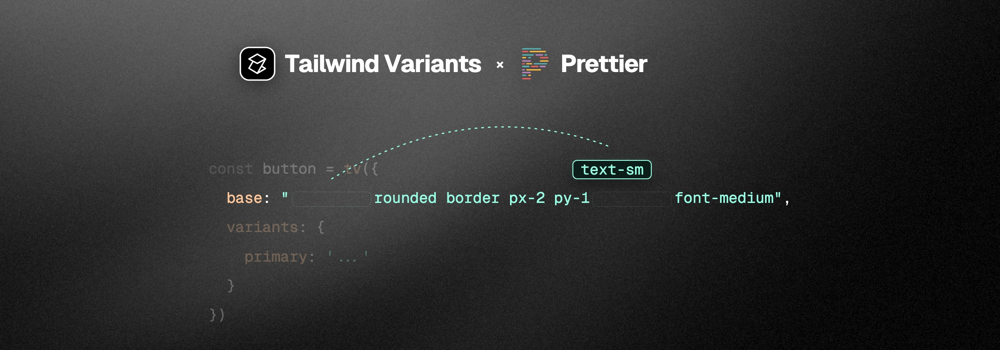

# prettier-plugin-tailwind-variants



A [Prettier](https://prettier.io/) plugin for [Tailwind Variants](https://www.tailwind-variants.org/). Formats `tv()` class arrays while preserving structure, then sorts with [`prettier-plugin-tailwindcss`](https://github.com/tailwindlabs/prettier-plugin-tailwindcss).

[](https://www.npmjs.com/package/prettier-plugin-tailwind-variants)
[](./LICENSE)
[](https://github.com/tianenpang/prettier-plugin-tailwind-variants/actions/workflows/ci.yml)

## Installation

```sh
pnpm add -D prettier prettier-plugin-tailwindcss@^0.8.0 prettier-plugin-tailwind-variants
```

```js
// prettier.config.js
import * as tailwindcss from 'prettier-plugin-tailwindcss';
import tailwindVariants from 'prettier-plugin-tailwind-variants';

/** @type {import('prettier').Config} */
export default {
  plugins: [tailwindVariants(tailwindcss)],
  tailwindFunctions: ['tv'],
  tvFunctions: ['tv']
};
```

Must be composed with `prettier-plugin-tailwindcss` as above.

## Options

| Option                      | Default  | Description                                                                                        |
| --------------------------- | -------- | -------------------------------------------------------------------------------------------------- |
| `tvFunctions`               | `['tv']` | Callee names to format. Keep `tailwindFunctions` in sync for string sorting.                       |
| `tvUnwrapSingleClassArrays` | `true`   | Unwrap nested single-class arrays into the parent sort pool. Ignored when grouping or flattening.  |
| `tvGroupByModifiers`        | `false`  | Split tokens into one string per modifier group (`base`, `hover`, `dark`, …).                      |
| `tvModifierGroupOrder`      | built-in | Group id order when grouping is on. Ignored when grouping is off.                                  |
| `tvFlattenToString`         | `false`  | Flatten arrays / nests into a single class string. Ignored for final shape when grouping is on.    |
| `tvRemoveEmptyClasses`      | `true`   | Remove empty / whitespace-only class strings and empty arrays.                                     |
| `tvGroupByBreakpoints`      | `false`  | When grouping, put each breakpoint (`sm`, `md`, …) in its own group. Ignored when grouping is off. |

**Shape priority:** `tvGroupByModifiers` → else `tvFlattenToString` → else preserve structure (+ unwrap).

```ts
// tvGroupByModifiers: true
base: ['dark:bg-black', 'px-4', 'hover:bg-red-500', 'py-2'];
// →
base: ['px-4 py-2', 'hover:bg-red-500', 'dark:bg-black'];

// tvFlattenToString: true
base: ['text-white', ['py-2', 'px-4'], 'rounded-lg'];
// →
base: 'rounded-lg px-4 py-2 text-white';
```

## Formatting

```ts
// Before
tv({
  base: ['text-white', ['py-2', 'px-4'], 'rounded-lg']
});

// After (default structure mode)
tv({
  base: ['rounded-lg', ['px-4', 'py-2'], 'text-white']
});
```

Covers `base`, `slots`, `variants`, `compoundVariants` / `compoundSlots` (`class` / `className`). JS/TS and `<script>` regions (Vue, Svelte, Astro, HTML, …); CSS is left alone. Framework parsers need their own Prettier plugins.

## Editor IntelliSense

Prefer key-scoped `classRegex` over `classFunctions: ["tv"]` so conditions and `defaultVariants` are skipped. Copy from [`.vscode/settings.json`](./.vscode/settings.json) and enable `"editor.quickSuggestions": { "strings": "on" }`.

```json
{
  "tailwindCSS.experimental.classRegex": [
    ["\\b(?:base|class|className)\\s*:\\s*['\"`]([^'\"`]*)['\"`]"],
    [
      "\\b(?:base|class|className)\\s*:\\s*(\\[(?:[^\\[\\]]|\\[(?:[^\\[\\]]|\\[(?:[^\\[\\]]|\\[[^\\[\\]]*\\])*\\])*\\])*\\])",
      "['\"`]([^'\"`]*)['\"`]"
    ],
    ["\\b(?:class|className)\\s*:\\s*(\\{(?:[^{}]|\\{[^{}]*\\})*\\})", "['\"`]([^'\"`]*)['\"`]"],
    ["\\bslots\\s*:\\s*(\\{(?:[^{}]|\\{[^{}]*\\})*\\})", "['\"`]([^'\"`]*)['\"`]"],
    [
      "\\bvariants\\s*:\\s*(\\{(?:[^{}]|\\{(?:[^{}]|\\{(?:[^{}]|\\{[^{}]*\\})*\\})*\\})*\\})",
      "['\"`]([^'\"`]*)['\"`]"
    ]
  ]
}
```

## Limitations

- Static strings and literal arrays only
- Dynamic values skip that array
- Peers: `prettier@^3.0.0`, `prettier-plugin-tailwindcss@^0.8.0`

## Community

[Contributing](./CONTRIBUTING.md) · [Code of Conduct](./CODE_OF_CONDUCT.md) · [Security](./SECURITY.md) · [Support](./SUPPORT.md)

## License

[MIT](./LICENSE)
